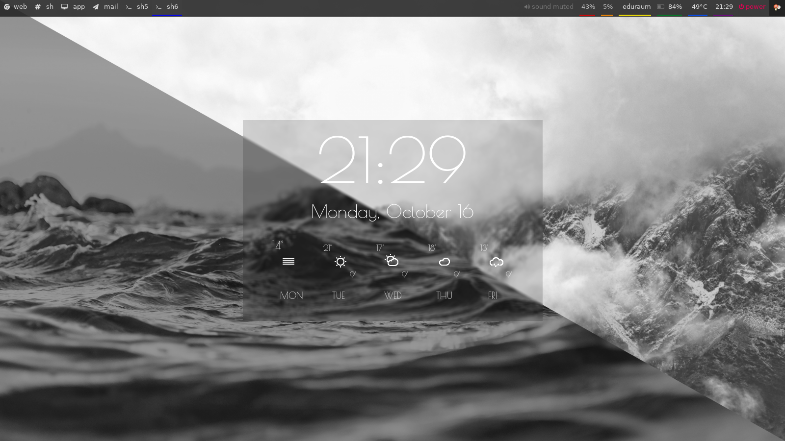

# .dotfiles
dotfiles for my current setup

I use arch, so most dotfiles depend on the newest version of the programs.

## Programs
- dunst
- git
- gopass
- i3-gaps
- mutt
- polybar
- variety
- vim
- zsh

